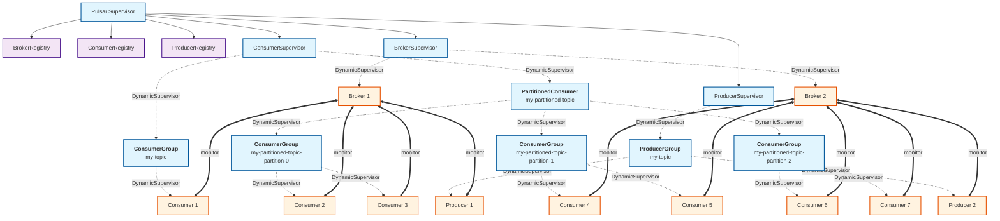

# Elixir Client for Apache Pulsar

> [!CAUTION]
> This project is a prototype in very early development and it is likely to be
> abandoned before it reaches maturity. Don't waste your time on it! ;)

An Elixir client for [Apache Pulsar](https://pulsar.apache.org/).


## Architecture




## Usage

The package can be installed by adding `pulsar` to your list of dependencies in `mix.exs`:

```elixir
def deps do
  [{:pulsar, git: "https://github.com/efcasado/pulsar-elixir"}]
end
```

You can configure the client by adding the following configuration to your `config/config.exs`:

```elixir
config :pulsar,
  host: "pulsar://localhost:6650",
  socket_opts: [verify: :verify_none],
  auth: [
    type: Pulsar.Auth.OAuth2
    settings: [
        client_id: "<YOUR-OAUTH2-CLIENT-ID>",
        client_secret: "<YOUR-OAUTH2-CLIENT-SECRET>",
        site: "<YOUR-OAUTH2-ISSUER-URL>",
        audience: "<YOUR-OAUTH2-AUDIENCE>"
    ]
  ],
  consumers: [
    my_consumer: [
        topic: "persistent://my-tenant/my-namespace/my-topic",
        subscription_name: "my-subscription",
        callback_module: MyApp.MyConsumer,
        opts: [
          subscription_type: "Exclusive",
          flow_initial: 100,
          flow_threshold: 50,
          flow_refill: 50,
          initial_position: :earliest
          durable: true,
          force_create_topic: true
        ]
    ]
  ]
```
Alternatively, you can start the Pulsar client on demand and add it to your application's supervisor
by calling `Pulsar.start/1` directly, as follows:

```elixir
{:ok, pid} = Pulsar.start(
  host: "pulsar://localhost:6650",
  socket_opts: [verify: :verify_none],
  auth: [
    type: Pulsar.Auth.OAuth2
    settings: [
        client_id: "<YOUR-OAUTH2-CLIENT-ID>",
        client_secret: "<YOUR-OAUTH2-CLIENT-SECRET>",
        site: "<YOUR-OAUTH2-ISSUER-URL>",
        audience: "<YOUR-OAUTH2-AUDIENCE>"
    ]
  ],
  consumers: [
    my_consumer: [
        topic: "persistent://my-tenant/my-namespace/my-topic",
        subscription_name: "my-subscription",
        callback_module: MyApp.MyConsumer,
        opts: [
          subscription_type: "Exclusive",
          flow_initial: 100,
          flow_threshold: 50,
          flow_refill: 50,
          initial_position: :earliest
          durable: true,
          force_create_topic: true
        ]
    ]
  ],
  producers: [
    my_producer: [
        topic: "persistent://my-tenant/my-namespace/my-topic"
    ]
  ]
)
```

Then, to produce message to a topic you can do as follows:

```elixir
{:ok, message_id} = Pulsar.send("my-producer", "Hello, Pulsar!")
```


## Testing

> [!IMPORTANT]
> Do not forget to add the following line to your `/etc/hosts` file before running the tests:
>
> ```
> 127.0.0.1 broker1 broker2
> ```

To run the tests, run the following command:

```
mix test
```

If you want to run only a subset of tests, specify the file including the tests you want to run

```
mix test test/integration/consumer_test.exs
```

You can also run individual tests by passing the line number where they are defined

```
mix test test/integration/consumer_test.exs:43
```


## Features

The full feature matrix for Apache Pulsar can be found [here](https://pulsar.apache.org/client-feature-matrix/).

| Component | Feature                            | Supported |
|-----------|------------------------------------|-----------|
| Client    | TLS encryption                     | ✅        |
| Client    | Authentication                     | ⚠️        |
| Client    | Transaction                        | ❌        |
| Client    | Statistics                         | ❌        |
| Producer  | Sync send                          | ✅        |
| Producer  | Async send                         | ❌        |
| Producer  | Batching                           | ❌        |
| Producer  | Chunking                           | ❌        |
| Producer  | Compression                        | ❌        |
| Producer  | Schema                             | ❌        |
| Producer  | Partitioned topics                 | ❌        |
| Producer  | Access modes                       | ❌        |
| Consumer  | ACK                                | ✅        |
| Consumer  | Batch-index ACK                    | ✅        |
| Consumer  | NACK                               | ❌        |
| Consumer  | NACK back-off                      | ❌        |
| Consumer  | Batching                           | ✅        |
| Consumer  | Partitioned topics                 | ✅        |
| Consumer  | Chunking                           | ❌        |
| Consumer  | Seek                               | ✅        |
| Consumer  | Subscription types                 | ✅        |
| Consumer  | Subscription modes                 | ✅        |
| Consumer  | Retry letter topic                 | ❌        |
| Consumer  | Dead letter topic                  | ❌        |
| Consumer  | Compression                        | ❌        |
| Consumer  | Compaction                         | ❌        |
| Consumer  | Schema                             | ❌        |
| Consumer  | Configurable flow control settings | ✅        |
| Reader    |                                    | ❌        |
| TableView |                                    | ❌        |
