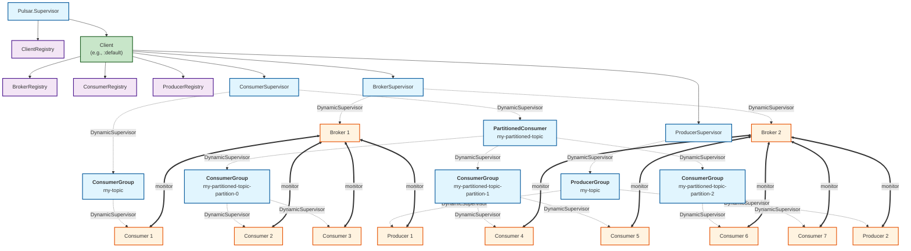

# Elixir Client for Apache Pulsar

> [!CAUTION]
> This project is a prototype in very early development. APIs are likely to break often
> until the project reaches its first stable release.

An Elixir client for [Apache Pulsar](https://pulsar.apache.org/).

If you are interested in using this library together with [Broadway](https://github.com/dashbitco/broadway),
check our [Broadway producer for Pulsar](https://github.com/efcasado/off_broadway_pulsar).

## Architecture

The library supports multi-client architecture, allowing you to connect to multiple Pulsar clusters simultaneously.
Each client maintains its own set of registries and supervisors for brokers, consumers, and producers.




## Usage

The package can be installed by adding `pulsar` to your list of dependencies in `mix.exs`:

```elixir
def deps do
  [{:pulsar, git: "https://github.com/efcasado/pulsar-elixir"}]
end
```

### Single Client Configuration

You can configure the client by adding the following configuration to your `config/config.exs`:

```elixir
config :pulsar,
  host: "pulsar://localhost:6650",
  socket_opts: [verify: :verify_none],
  auth: [
    type: Pulsar.Auth.OAuth2,
    settings: [
        client_id: "<YOUR-OAUTH2-CLIENT-ID>",
        client_secret: "<YOUR-OAUTH2-CLIENT-SECRET>",
        site: "<YOUR-OAUTH2-ISSUER-URL>",
        audience: "<YOUR-OAUTH2-AUDIENCE>"
    ]
  ],
  consumers: [
    my_consumer: [
        topic: "persistent://my-tenant/my-namespace/my-topic",
        subscription_name: "my-subscription",
        callback_module: MyApp.MyConsumer,
        subscription_type: :Exclusive,
        flow_initial: 100,
        flow_threshold: 50,
        flow_refill: 50,
        initial_position: :earliest,
        durable: true,
        force_create_topic: true,
        dead_letter_policy: [
          max_redelivery: 3,
          topic: "persistent://my-tenant/my-namespace/my-topic-my-subscription-DLQ",
          producer: "my-topic-my-subscription-my-consumer-13243-DLQ"
        ],
        redelivery_interval: 1000
    ]
  ],
  producers: [
    my_producer: [
        topic: "persistent://my-tenant/my-namespace/my-topic"
    ]
  ]
```

### Multi-Client Configuration

You can also configure multiple clients to connect to different Pulsar clusters:

```elixir
config :pulsar,
  clients: [
    default: [
      host: "pulsar://localhost:6650",
      socket_opts: [verify: :verify_none]
    ],
    cluster_2: [
      host: "pulsar://other-cluster:6650",
      socket_opts: [verify: :verify_none],
      auth: [
        type: Pulsar.Auth.OAuth2,
        settings: [
          client_id: "<YOUR-OAUTH2-CLIENT-ID>",
          client_secret: "<YOUR-OAUTH2-CLIENT-SECRET>",
          site: "<YOUR-OAUTH2-ISSUER-URL>",
          audience: "<YOUR-OAUTH2-AUDIENCE>"
        ]
      ]
    ]
  ],
  consumers: [
    my_consumer: [
        client: :default,  # optional, defaults to :default
        topic: "persistent://my-tenant/my-namespace/my-topic",
        subscription_name: "my-subscription",
        callback_module: MyApp.MyConsumer,
        subscription_type: :Exclusive
    ],
    other_consumer: [
        client: :cluster_2,
        topic: "persistent://other-tenant/other-namespace/other-topic",
        subscription_name: "other-subscription",
        callback_module: MyApp.OtherConsumer,
        subscription_type: :Shared
    ]
  ],
  producers: [
    my_producer: [
        client: :default,
        topic: "persistent://my-tenant/my-namespace/my-topic"
    ],
    other_producer: [
        client: :cluster_2,
        topic: "persistent://other-tenant/other-namespace/other-topic"
    ]
  ]
```
### Manual Mode

Alternatively, you can start the Pulsar client on demand and add it to your application's supervisor
by calling `Pulsar.start/1` directly. This is useful when you want full control over the lifecycle
or when using Pulsar as an included application.

**Single client:**
```elixir
{:ok, pid} = Pulsar.start(
  host: "pulsar://localhost:6650",
  socket_opts: [verify: :verify_none],
  consumers: [
    my_consumer: [
        topic: "persistent://my-tenant/my-namespace/my-topic",
        subscription_name: "my-subscription",
        callback_module: MyApp.MyConsumer,
        subscription_type: :Exclusive,
        flow_initial: 100,
        flow_threshold: 50,
        flow_refill: 50,
        initial_position: :earliest,
        durable: true,
        force_create_topic: true
    ]
  ],
  producers: [
    my_producer: [
        topic: "persistent://my-tenant/my-namespace/my-topic"
    ]
  ]
)
```

**Multiple clients:**
```elixir
{:ok, pid} = Pulsar.start(
  clients: [
    default: [host: "pulsar://localhost:6650"],
    cluster_2: [host: "pulsar://other-cluster:6650"]
  ],
  consumers: [
    my_consumer: [
        client: :default,
        topic: "persistent://my-tenant/my-namespace/my-topic",
        subscription_name: "my-subscription",
        callback_module: MyApp.MyConsumer
    ],
    other_consumer: [
        client: :cluster_2,
        topic: "persistent://other-tenant/other-namespace/other-topic",
        subscription_name: "other-subscription",
        callback_module: MyApp.OtherConsumer
    ]
  ],
  producers: [
    my_producer: [client: :default, topic: "persistent://my-tenant/my-namespace/my-topic"],
    other_producer: [client: :cluster_2, topic: "persistent://other-tenant/other-namespace/other-topic"]
  ]
)
```

**Fully manual (programmatic control):**

For complete control, you can start clients, consumers, and producers manually in your own supervision tree:

```elixir
# In your application supervisor
children = [
  {Registry, keys: :unique, name: Pulsar.ClientRegistry},
  {Pulsar.Client, name: :my_client, host: "pulsar://localhost:6650"}
]

Supervisor.start_link(children, strategy: :one_for_one)

# Later, start consumers and producers as needed
# The client will automatically handle broker connections
{:ok, consumer_pid} = Pulsar.start_consumer(
  "persistent://my-tenant/my-namespace/my-topic",
  "my-subscription",
  MyApp.MyConsumer,
  client: :my_client
)

{:ok, producer_pid} = Pulsar.start_producer(
  "persistent://my-tenant/my-namespace/my-topic",
  client: :my_client
)
```

Then, to produce message to a topic you can do as follows:

```elixir
{:ok, message_id} = Pulsar.send(:my-producer, "Hello, Pulsar!")
```


## Testing

> [!IMPORTANT]
> Do not forget to add the following line to your `/etc/hosts` file before running the tests:
>
> ```
> 127.0.0.1 broker1 broker2
> ```

To run the tests, run the following command:

```
mix test
```

If you want to run only a subset of tests, specify the file including the tests you want to run

```
mix test test/integration/consumer_test.exs
```

You can also run individual tests by passing the line number where they are defined

```
mix test test/integration/consumer_test.exs:43
```


## Examples

> [!IMPORTANT]
> Do not forget to add the following line to your `/etc/hosts` file before running the tests:
>
> ```
> 127.0.0.1 broker1 broker2
> ```
>
> You also need to run `docker compose up -d` manually before running the examples.

See the `examples` directory if you are interested in seeing how to use the Pulsar client to
build an end-to-end Pulsar application.

You can run the examples using the following command:

```
mix run --no-start examples/bingo.exs
```


## Features

The full feature matrix for Apache Pulsar can be found [here](https://pulsar.apache.org/client-feature-matrix/).

| Component | Feature                            | Supported |
|-----------|------------------------------------|-----------|
| Client    | TLS encryption                     | ✅        |
| Client    | Authentication                     | ⚠️        |
| Client    | Transaction                        | ❌        |
| Client    | Statistics                         | ❌        |
| Producer  | Sync send                          | ✅        |
| Producer  | Async send                         | ❌        |
| Producer  | Batching                           | ❌        |
| Producer  | Chunking                           | ❌        |
| Producer  | Compression                        | ✅        |
| Producer  | Schema                             | ❌        |
| Producer  | Partitioned topics                 | ❌        |
| Producer  | Access modes                       | ❌        |
| Consumer  | ACK                                | ✅        |
| Consumer  | Batch-index ACK                    | ✅        |
| Consumer  | NACK                               | ✅        |
| Consumer  | NACK back-off                      | ❌        |
| Consumer  | Batching                           | ✅        |
| Consumer  | Partitioned topics                 | ✅        |
| Consumer  | Chunking                           | ❌        |
| Consumer  | Seek                               | ✅        |
| Consumer  | Subscription types                 | ✅        |
| Consumer  | Subscription modes                 | ✅        |
| Consumer  | Retry letter topic                 | ❌        |
| Consumer  | Dead letter topic                  | ✅        |
| Consumer  | Compression                        | ✅        |
| Consumer  | Compaction                         | ❌        |
| Consumer  | Schema                             | ❌        |
| Consumer  | Configurable flow control settings | ✅        |
| Reader    |                                    | ❌        |
| TableView |                                    | ❌        |
